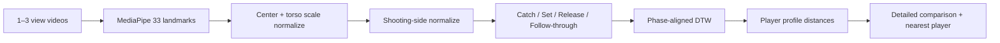

<div align="center">

# 🎯 Shooting Form Analysis

### Compare the motion, not just the silhouette.

농구 슛 영상을 **pose 정규화 + phase alignment + DTW**로 비교하는 Flask 기반 분석 실험입니다.

<p>
  
  
  
  
</p>

[Pipeline](#analysis-pipeline) · [Features](#features) · [Data](#data-handling) · [Limits](#limits)

</div>

---

“누구랑 비슷해 보인다” 정도에서 끝내지 않고, **관절 움직임 전체를 같은 기준으로 맞춘 뒤 비교**하려고 만든 실험용 분석기입니다.

> 이 프로젝트는 코칭 보조 실험입니다. 의료·재활·정밀 생체역학 측정 도구가 아닙니다.

## Analysis pipeline



### Why normalize?

픽셀 좌표를 그대로 비교하면 키와 카메라 거리가 결과에 크게 섞입니다.

```text
33 landmarks
→ torso-centered
→ torso-scale normalized
→ right/left shooting side aligned
```

### Why DTW?

두 사람이 같은 속도로 슛하지 않기 때문에 frame 번호를 그대로 맞추지 않습니다. DTW는 조금 빠르거나 느린 움직임도 **동작 phase 기준으로 대응**시킬 수 있게 해줍니다.

## Features

| Feature | Description |
|---|---|
| Multi-view input | side / front / oblique 1–3개 시점 |
| Shooter selection | 영상 속 분석 대상 선택 |
| Pose normalization | 33 landmark 정규화 |
| Phase comparison | catch → follow-through alignment |
| Similarity | phase-aligned DTW |
| Player search | selected player + nearest player |
| Motion view | 공통 skeleton 3D timeline / scrub / rotate |

## Run

```bash
pip install -r requirements.txt
python run.py
# http://127.0.0.1:7860
```

검증:

```bash
python -m unittest discover -s tests -v
python scripts/validate_motion_dataset.py --min-clips 3
```

## Data handling

선수 model은 quality filter를 통과한 공개 슈팅 영상에서 분석용 motion profile을 만듭니다. 저장소에는 candidate metadata와 source URL만 남기고 다운로드한 원본 영상 자체는 재배포하지 않습니다.

```bash
pip install -r requirements-data.txt
python scripts/build_youtube_catalog.py
python scripts/discover_allstar_players.py
```

## Where this repo fits

```text
shooting-form-analysis       = 빠른 pose / DTW 분석 실험
shooting-profile-coach-ios   = FormPath 제품 중심 저장소
```

제품의 iPhone flow와 데이터 등급 정책은 `Rudwpahs/shooting-profile-coach-ios`를 기준으로 봅니다.

## Structure

| Path | Role |
|---|---|
| `app/` | pose, angles, similarity, DB, Flask API |
| `static/` | web UI |
| `models/` | motion profiles, catalog, validation report |
| `scripts/` | data discovery / build / validation |
| `data/` | runtime SQLite |
| `Dockerfile` | production image |
| `design-system/` | UI rules |

## Limits

- 카메라 각도, framing, 가림에 영향을 받습니다.
- monocular landmark depth는 실제 계측된 3D가 아닙니다.
- fixed skeleton은 실제 선수 신체 치수를 재현하지 않습니다.
- 공개 영상 기반 player profile은 비공식 분석값입니다.
- 특이한 편집 영상에서는 release 구간 검출이 틀릴 수 있습니다.

Render 배포 설정은 `DEPLOYMENT.md`에 있습니다.
